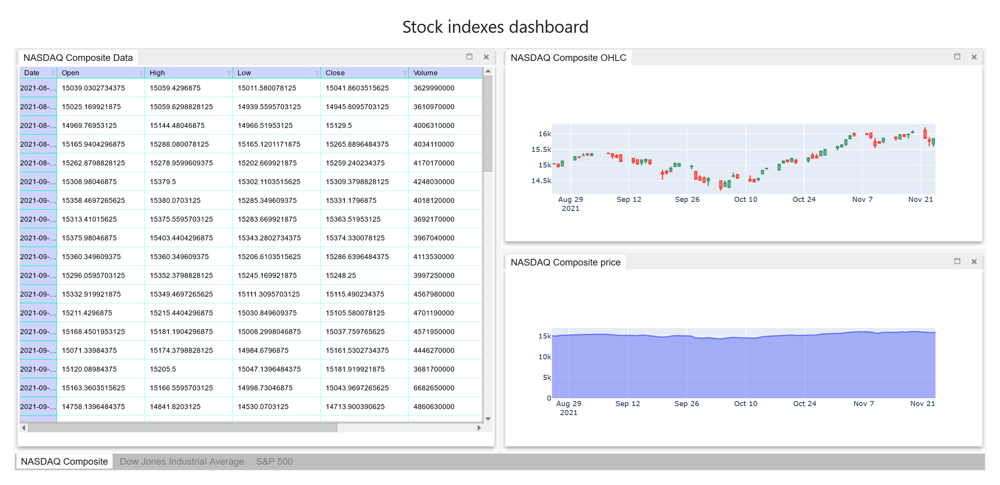

ipyflex: A WYSIWYG layout editor for Jupyter widgets
=====================================================

Version: |release|

**ipyflex** aims to help users transform existing `Jupyter widgets`_ into an interactive dashboard with a sophisticated layout without coding.  

By being a Jupyter widget itself, **ipyflex** can be easily integrated with  `Voila`_  to deploy the dashboard.

   A **ipyflex** dashboard deployed with *Voila*.  

Quickstart
----------

To get started with ipyflex, install with pip::

    pip install ipyflex

or with conda::

    conda install -c conda-forge  ipyflex

Contents
--------

.. toctree::
   :maxdepth: 2
   :caption: Installation and usage

   installing
   usage

.. toctree::
   :maxdepth: 1

   examples/index

.. toctree::
   :maxdepth: 1
   :caption: Changelog
   
   changelog

.. toctree::
   :maxdepth: 2
   :caption: Development

   develop-install

.. links

.. _`Jupyter widgets`: https://jupyter.org/widgets.html

.. _`notebook`: https://jupyter-notebook.readthedocs.io/en/latest/

.. _`Voila`: https://github.com/voila-dashboards/voila
