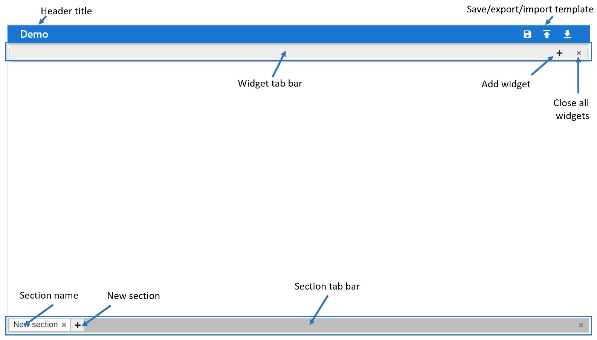

=============
Usage
=============

**ipyflex** is meant to be used with widgets based on `ipywidgets`_. The entry point of **ipyflex** is the `FlexLayout` class, it allows users to dynamically customize the layout and fill their dashboard from the existing widgets.

Create a dashboard from existing widgets
==========================================

The simplest way to create an **ipyflex** dashboard is to create a dictionary of existing widgets with the `keys` are the names of the widget and `values` are the instances of widgets and then use `FlexLayout` to compose the layout.

.. code:: Python

    from ipyflex import FlexLayout
    import ipywidgets as ipw
    widgets = { 'Widget 1': ipw.HTML('<h1> Widget 1</h1>'),
                'Widget 2': ipw.HTML('<h1> Widget 2</h1>'), 
                'Widget 3': ipw.HTML('<h1> Widget 3</h1>'),
                'Widget 4': ipw.HTML('<h1> Widget 4</h1>')
            }
    dashboard = FlexLayout(widgets)
    dashboard

.. image:: images/ipyflex.gif
  
Users can pass some configurations to the constructor of *FlexLayout* to set the template of the style of the dashboard:

.. code:: Python

    dashboard = FlexLayout(widgets,
        template = 'saved.json', 
        style = {'height': '50vh', 'borderTop': '5px'},
        editable = False)

- *template*: the path to save template file, this file can be generated from the dashboard interface.
- *style*: CSS styles to be passed to the root element of the dashboard, it accepts any CSS rules but the keys need to be in *camelCase* format. 
- *editable*: flag to enable or disable the editable mode. In non-editable mode, the toolbar with the *Save template* button is removed, tabs can not be removed, dragged, or renamed.

----------------------------
FlexLayout interface
----------------------------

*FlexLayout* interface is composed of three components:

- Toolbar: located at bottom of the interface, it contains the button to save the current layout template to disk.
- Section tab bar: a bar to hold the section tabs, it is located on top of the toolbar. A *FlexLayout* dashboard can contain multiple sections.
- Section display window: the activated section is shown in this window. Each section is can be composed of multiple widgets.

A typical interface is displayed in the figure below:

----------------------------
Toolbar 
----------------------------

- **Save template**: save dashboard configuration into a *json* file in the current working folder. If *FlexLayout* is started with a template, the current template will be overwritten.

----------------------------
Section tab bar 
----------------------------

- Uses can use **+** button to add a new section into the dashboard, a section is displayed as a tab in the section tab bar. Each section can be dragged to modify its position, double-clicked to rename, and removed with the **x** button.

.. image:: images/ipyflex-section.gif

--------------------------
Section display window
--------------------------

- A section is composed of multiple widgets, users can use the *add widget* button to add the predefined widgets into the section. The added widget will be displayed in the widget tab bar with the name taken from its key in the widget dictionary.
- A typical layout of a section with annotation for buttons is shown in the image below:

.. image:: images/ipyflex-widget-window.png

- The widget menu can be opened by the *add widget* button, it contains the keys of the widget dictionary defined in the constructor of *FlexLayout*. The *Create new* item in the widget menu is always available, it will be detailed in the next section. 
- Right-click on the section name will give users options to show or hide the widget tab bar of this section.
- Users can customize the layout of a section by using drag and drop on each widget. The widgets can also be resized by dragging their borders.
- Users can change the name of the widget tab by double-clicking on the tab name.

.. image:: images/ipyflex-widget-main.gif

Create a dashboard layout without widgets
==========================================

Even without widgets, users can still define a dashboard layout with *FlexLayout* and then fill the dashboard progressively. To do so, just use the *Create new* button in the widget menu to add widgets to the dashboard, the placeholder tabs will be created for the new widgets. Once the real widgets are ready, users can update the dashboard with :code:`add` method:

.. code:: Python

    dashboard = FlexLayout() # Create an empty dashboard
    #Add a widget named `foo` to the dashboard by using `Create new` button
    #Now add the real widget `foo_widget` to dashboard
    dashboard.add('foo', foo_widget)
    #The dashboard will be updated with the real widget.

.. image:: images/ipyflex-create-new.gif

.. links

.. _`ipywidgets`: https://github.com/jupyter-widgets/ipywidgets/